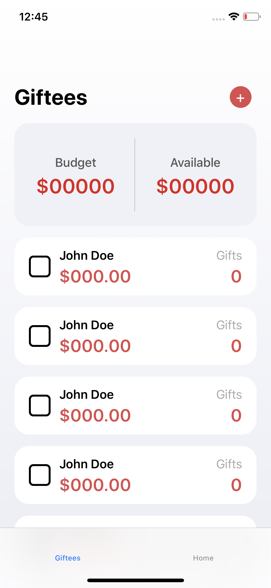
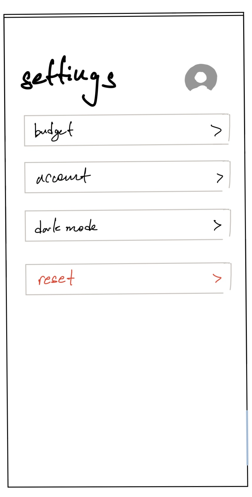
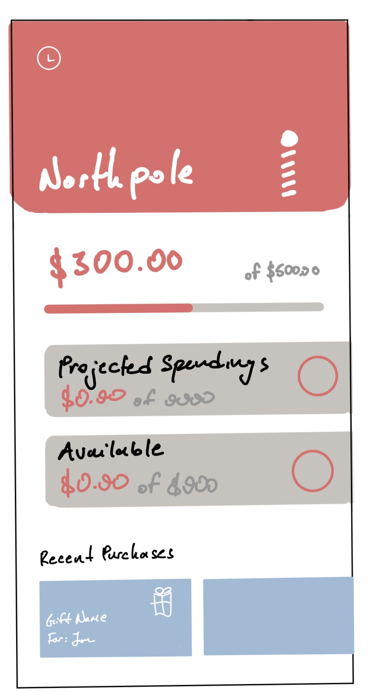
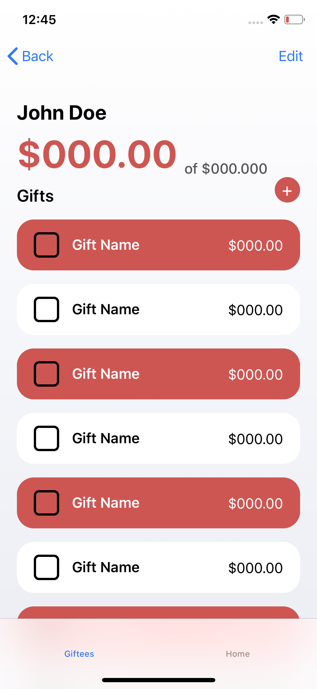
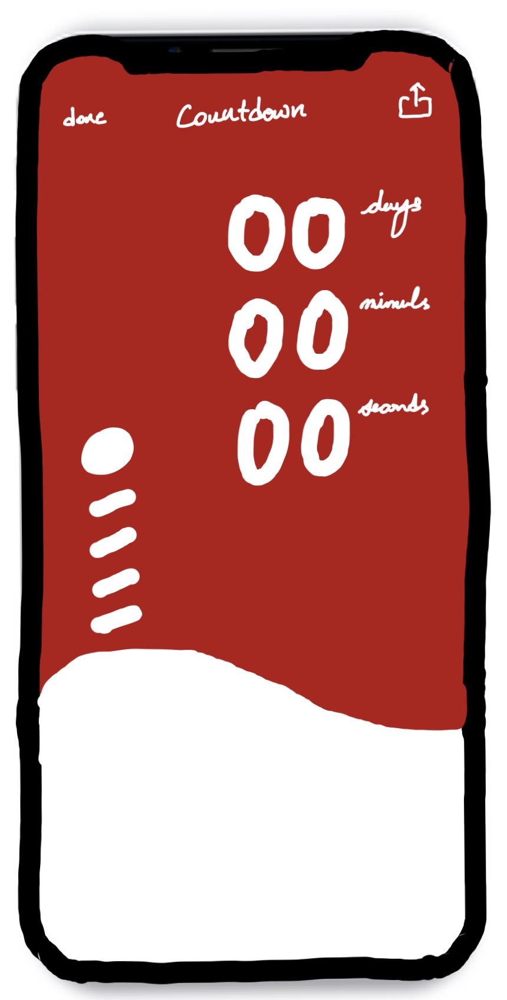
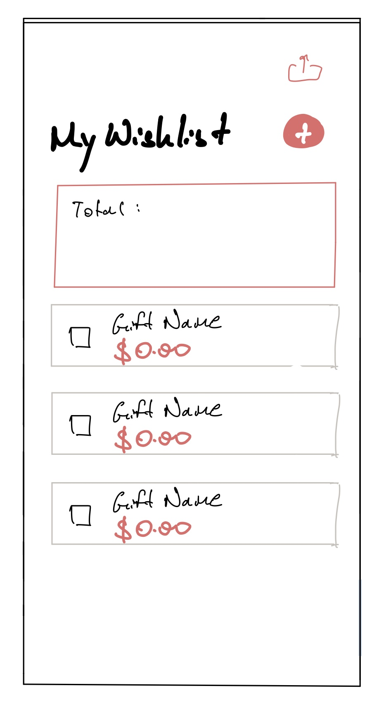

# North Pole: Holiday Budgeting

> Group 12: Daniel, Davy, Yash, Viviana

### Trello
https://trello.com/b/HHd9J0U0/north-pole

##  Functionality

1. Track gifts for different people
2. CRUD functionality per person (recipient)
3. CRUD functionality per gift
4. Track expenses 
    - Maintain total budget/expenses
        - User can enter the total amount that they're willing to spend
        - App will notify user if expenses exceed current budgeting limit
    - Maintain expenses per person
        - Each person can have multiple gifts
        - Total expense per person will be a total of the price each gift associated to the person
5. Tracking Gifts
    - Users can check of a gift, implying that the gift has been bought
    - Once a user has checked off all gifts, the recipient of these gifts will be checked off as well implying that the user has finished purchasing gifts for the recipient.
6. Built in Christmas Countdown (or other holidays?)
    - Will display on the home view
7. Wish list of gift items that the user would like to recieve
    - Ideally, should be shareable via iMessage
8. Gift exchange functionality (if time)
    - User can create a gift exchange
    - Add a list of people
    - Randomly select a pair of two people to buy gifts for each other

## Third Party APIs

1. iOS Charts
2. iOS Spring (Animations)
3. Firebase Database
4. View animator 
5. Firebase Google analytics
6. Firebase registration

##  Data Objects

### Global Objects (per user)

1. Total budget (total amount user is willing to spend)
2. Total Spent (gifts that have been checked off, aka purchased)
3. Projected Spendings
4. Current expense (total amount user will currently be spending)
5. Wish list?
    - list of gifts associated to user

### Giftee Object (Recipient)

1. Name 
2. Budget (amount user is willing to spend on person)
3. List of Gifts
4. Metadata

### Gift Object

1. Name of gift
2. price of gift
3. didBuy (boolean)
4. Metadata

## Server

1. Firebase

## Views

### Goal

Keep views simple and precise. Total number of views should be no more than 5. Will make use of table views to list each recipient and another table view to represent gifts associated to recipient.

HomeViewController: Summary of expenses

RecipientViewController: List of all recipients (giftee)

RecipientDetailViewController: Display Recipient information along with gifts belonging to them

LoginViewController

Todo:

WishListViewController

SettingsViewController

GiftExchangeViewController?

CountdownViewController

### Protoypes

## Tasks and Timeline
Davy:
- Reimplementing the prototype backend (currently offline/arbitrary data) to work with Firebase to store data properly for giftees and gifts (2 days)
- Looking into API for wishlist idea (1 day)
- Implementing prototype backend for wishlist (1 day)

Daniel:
- Setting view controller UI (1-2 days)
- Countdown view controller UI (1-2 days)
- Finishing Home view controller UI (2-3 days)
- Wishlist view controller UI (1 day)

Yash:
- I’m going to help with saving and retrieving data from firebase (2-3 days)
- I will help Davy with the wishlist view controller and user interaction (3-4 days)

Viviana:
- Working on Firebase hierarchy with Yash and daniel. (1-2 days)
- Login View -- Add full name to register (1-2 days)
- Look into how hard it is to potentially implement permissions for users to use the app  (Invitation functionality) (1 days)
- Help Yash wishlist (1-2 days)

## Testing Plan
We will be asking friends and family to try out our app and rating from 1-5 on the following criteria:
- How easy is it to navigate around the app?
- How easy is the login/signup process?
- Does the layout of the app make sense to you as a user?
- How easy is it to manage your giftees and gifts?
- How helpful/useful is the budgeting and spending tracker to you for this holiday season?

## Marketing Strategies

1. Instagram
2. Facebook
3. Twitter
4. Wildfire?
5. Reddit
6. Homies/Family

